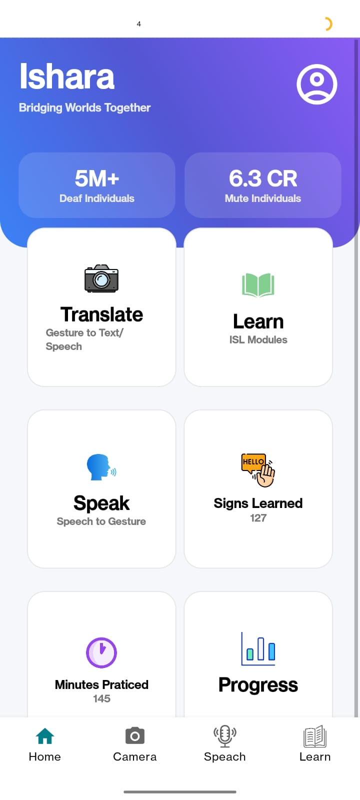
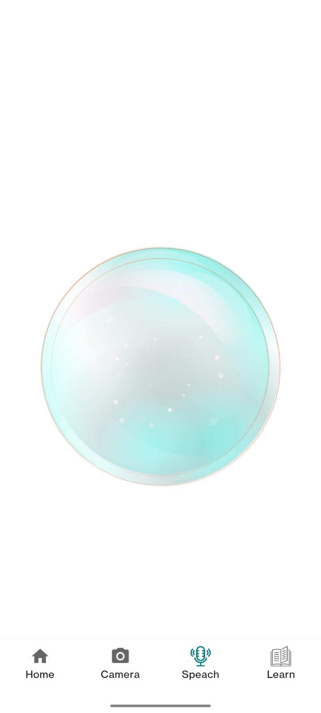
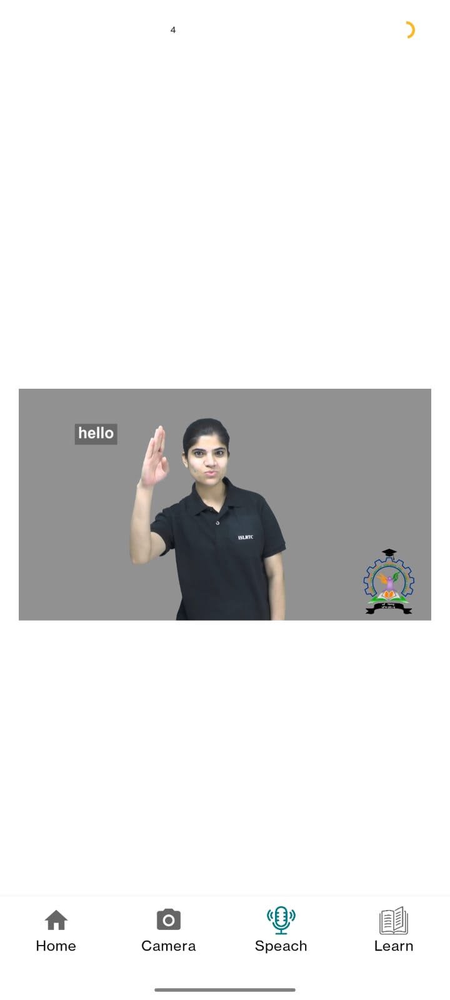
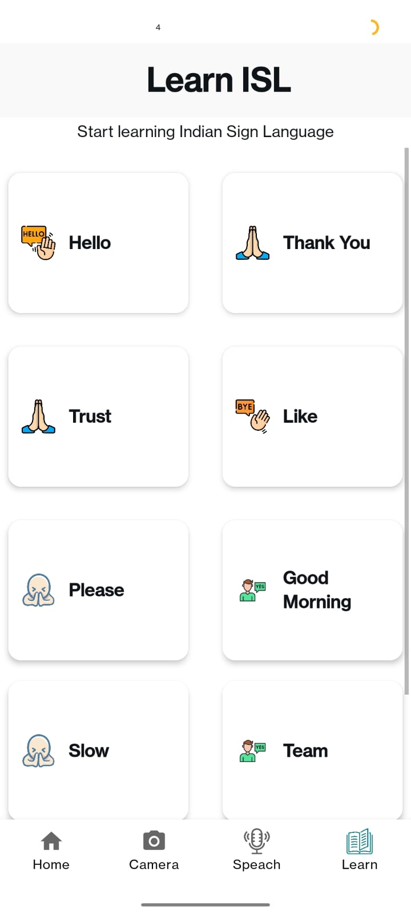
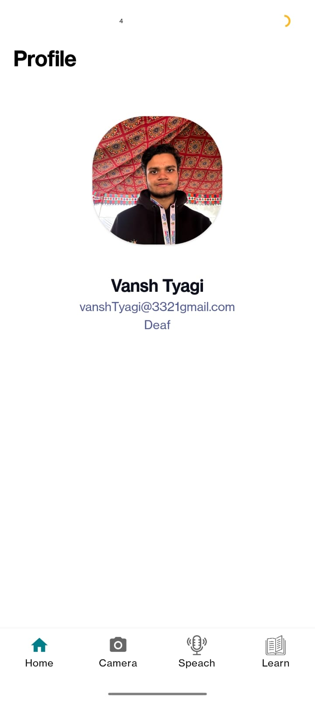

# 🇮🇳 Indian Sign Language Translator — ISHARA

## ⚠️ Deployment Notice  
**Not deployed yet.**  
We filed a **patent for this innovation 15 days ago**.  
Once the patent is published, we will go live on **Web & Play Store**.

---

  <em>Empowering communication for millions through AI-powered Indian Sign Language (ISL) recognition</em>

---

# 🧩 Problem Statement

Millions of individuals in India with hearing and speech impairments face communication challenges daily.

While American Sign Language (ASL) has seen strong technological advancement, **Indian Sign Language (ISL)** still lacks development.

### 🎯 Our Mission
Build a **real-time, user-friendly ISL Translator** that:

1. Recognizes ISL gestures using only a **webcam or smartphone camera**
2. Bridges communication gaps between ISL users and non-signers
3. Promotes ISL learning, accessibility & digital inclusion

---

# 🧠 Approach & Solution — Presenting **ISHARA**

Despite limited datasets and regional variations, ISHARA aims to:

1. Collect and curate reliable ISL gesture datasets  
2. Apply CNN + LSTM + CV techniques for gesture classification  
3. Enable real-time gesture detection  
4. Provide **Sign ➝ Text ➝ Speech** and **Text/Speech ➝ Sign** translation  
5. Offer an interactive learning module for ISL learners  

---

# 🧩 Core Components

| Feature | Description |
|--------|-------------|
| ✋ **Sign-to-Text/Speech** | Real-time gesture recognition with webcam or phone camera |
| 🗣️ **Speech/Text-to-Sign** | Converts spoken or typed input into ISL animations |
| 📚 **Learn ISL** | Static gesture visualization (A–Z, 1–9) for ISL literacy |

---

# ✨ Key Features

- Deep Learning–based Real-Time Gesture Detection (CNN + OpenCV)
- Sign ➝ Text ➝ Speech Converter  
- Speech/Text ➝ Sign Visual Animation  
- Multilingual Support using Google Translate  
- ISL Learning Module  
- Highly scalable, modular design  

---

# 🛠️ Tech Stack

| Technology | Purpose |
|-----------|----------|
| **Python** | Core backend logic |
| **OpenCV** | Frame processing & hand detection |
| **YOLOv8** | Gesture detection |
| **CNN / LSTM** | Gesture classification |
| **React** | Frontend/UI |
| **Text-to-Speech** | Audio output |
| **Speech Recognition** | Voice input |
| **Google Translate API** | Language processing |
| **Keras/TensorFlow** | Deep learning model training |
| **Pickle** | Saving encoders/models |

---

# 🏆 Achievements

This project is a major step toward **inclusive communication** for India’s hearing & speech-impaired community.

### 🎖 Recognitions:
- Selected by **Uttar Pradesh Innovation Hub**
- Received mentorship from experts  
- **Awarded by the Hon’ble Governor of Uttar Pradesh** for this innovation  

---
---

# 👥 Contributors

| Name | GitHub | Role |
|------|--------|------|
| **Krishnav Talukdar** | [@cyberconqueror](https://github.com/CYBERCONQUEROR) | Core Contributor – Model & System Development |

---

# 📱 Mobile App Screens — ISHARA (Android Version)

<h2 align="center">🏠 Home Page</h2>

  

---

<h2 align="center">🤟 Translate Indian Sign Language to Text & Voice</h2>

  

---

<h2 align="center">🎤 Translate Voice to ISL</h2>

  
  

---

<h2 align="center">📚 Learn ISL</h2>

  

---

<h2 align="center">👤 Profile</h2>

  

---

